# 🏠 Real Estate Flutter App

## 📱 Description
تطبيق موبايل لعرض وشراء العقارات، يتيح للمستخدمين استعراض العقارات، البحث عنها، حفظ المفضلة، والتواصل مع أصحاب العقارات من خلال واجهة سهلة وحديثة.

---

## ✨ Features

- 🏡 عرض العقارات
- 🔍 البحث والفلترة
- ❤️ إضافة العقارات إلى المفضلة
- 📍 عرض موقع العقار
- 🖼️ معرض صور العقار
- 👤 تسجيل الدخول وإنشاء حساب
- ⚙️ إدارة الملف الشخصي

---

## 🛠️ Technologies

- Flutter
- Dart
- GetX
- REST API
- Laravel Backend

---

## ▶️ Run

```bash
flutter pub get
flutter run
```

---

# 📸 App Screenshots

| | | |
|:-:|:-:|:-:|
| 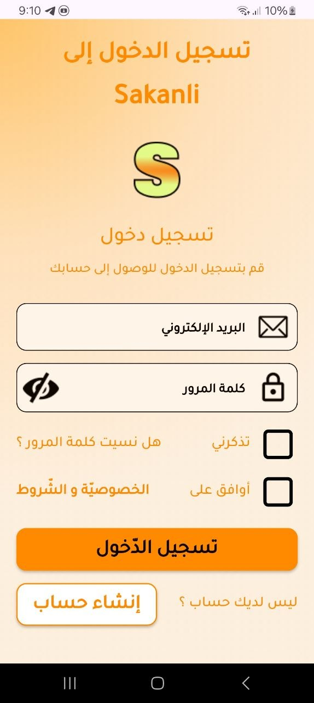 | 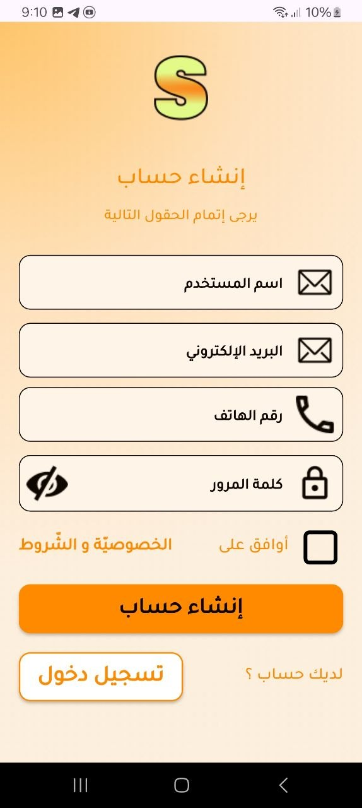 | 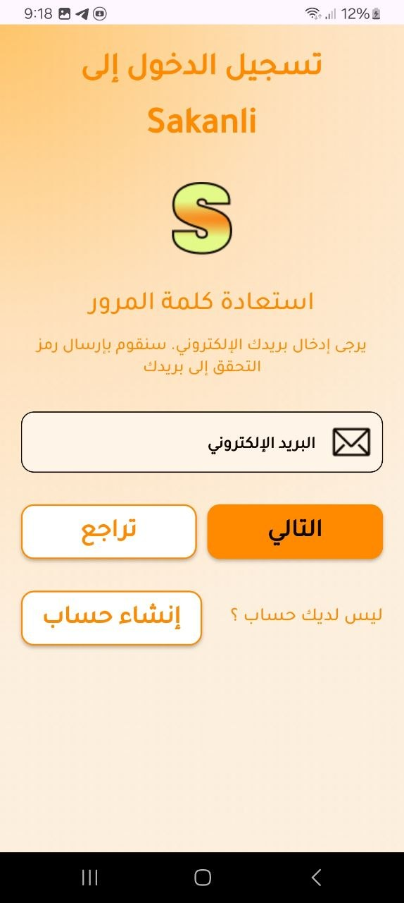 |
| 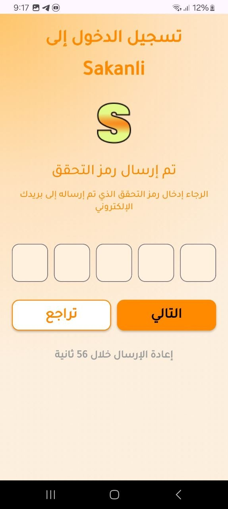 | 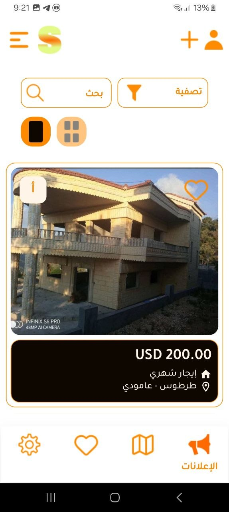 | 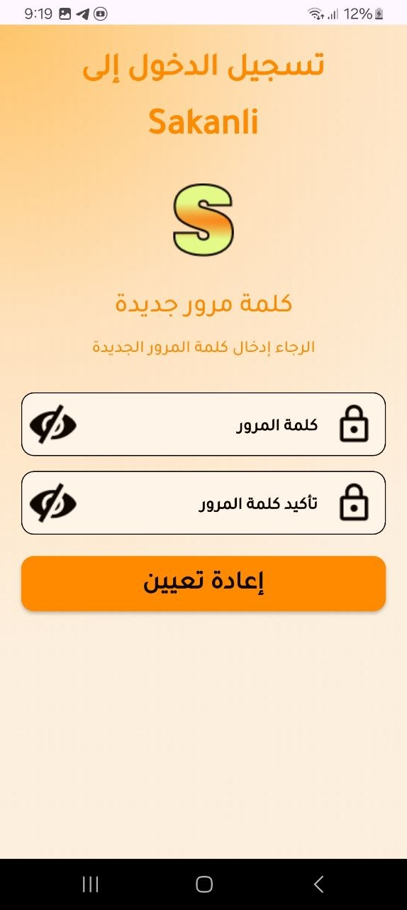 |
| 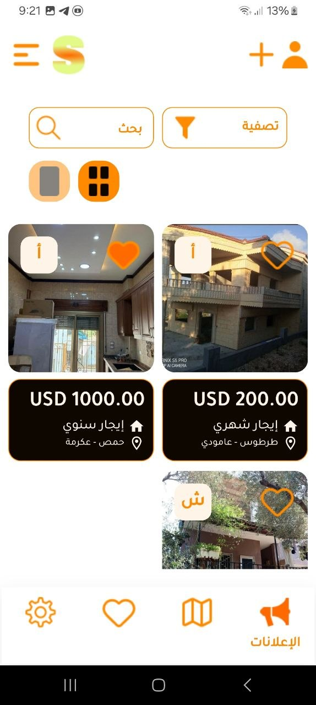 | 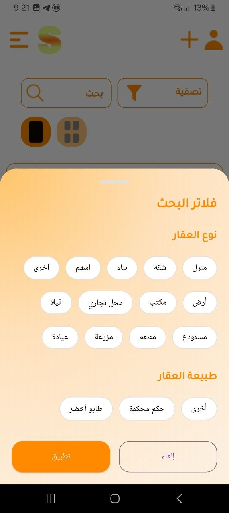 |  |
| 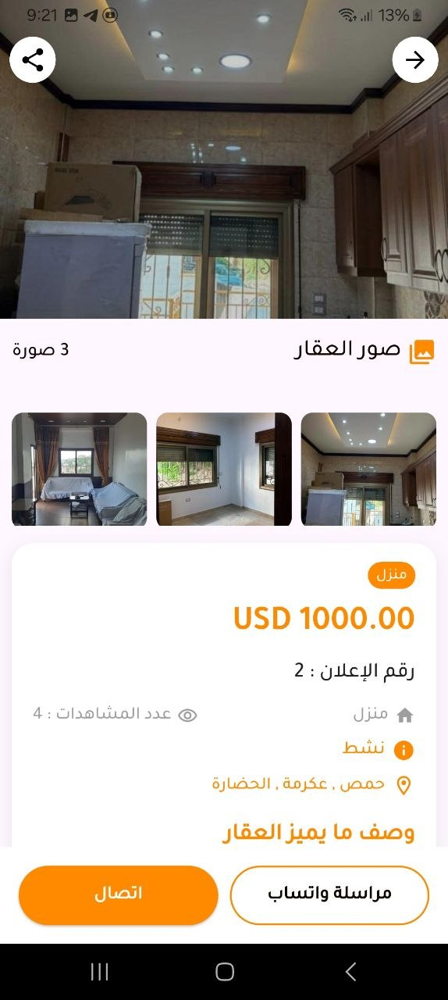 |  |  |
| 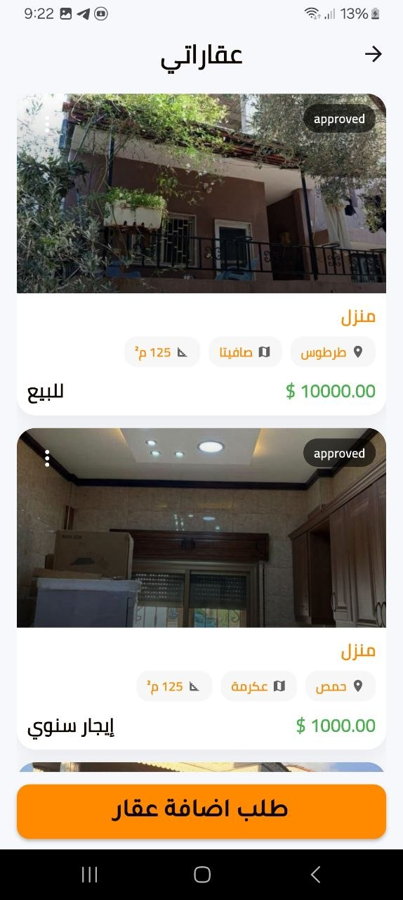 | 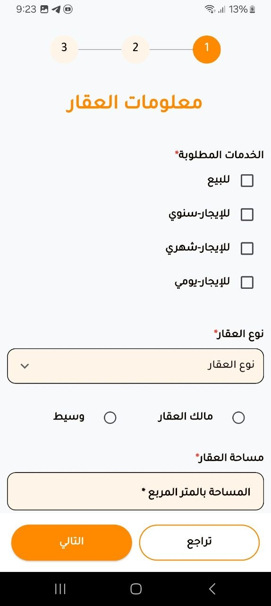 |  |
| 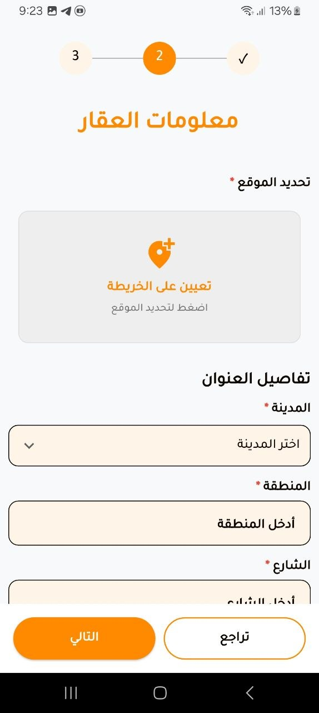 | 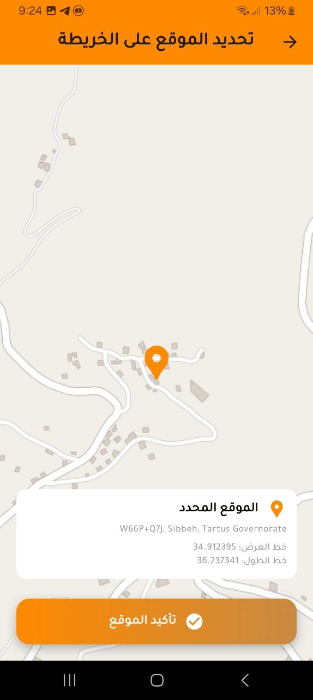 | 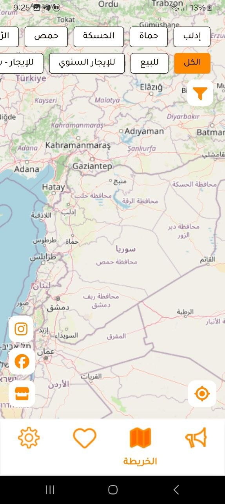 |
| 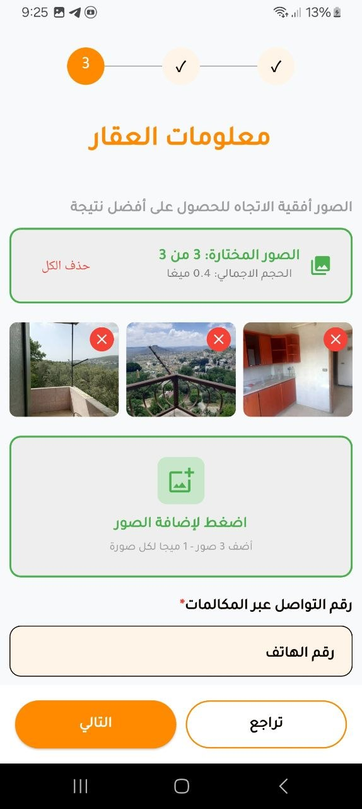 | 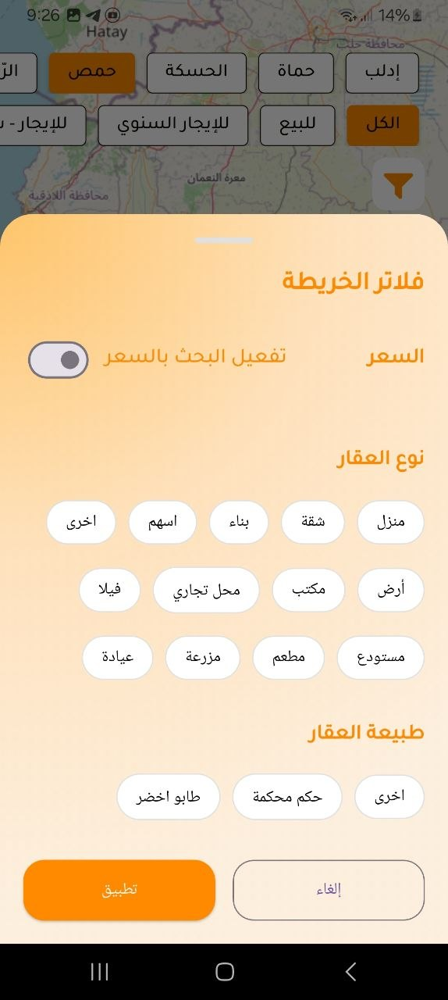 | 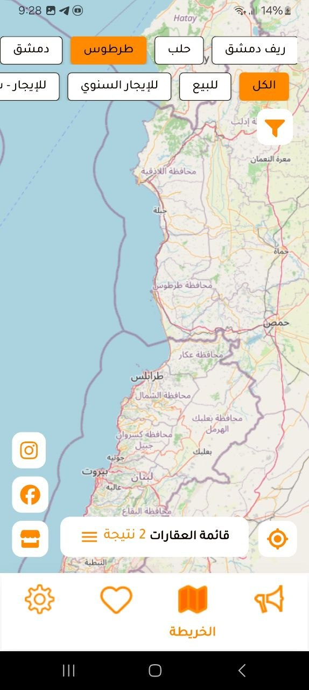 |
|  | 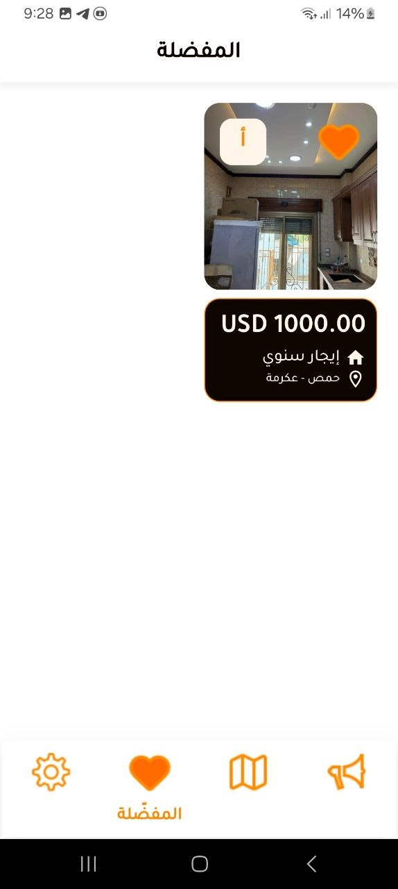 |  |
|  |  |  |
| 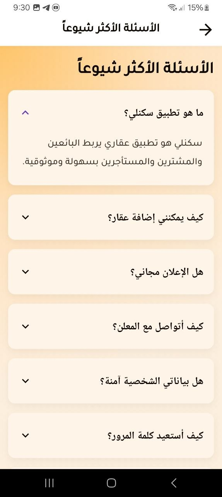 | | |

---

## 👨‍💻 Developer

**Nezar Shareef Khoder**
